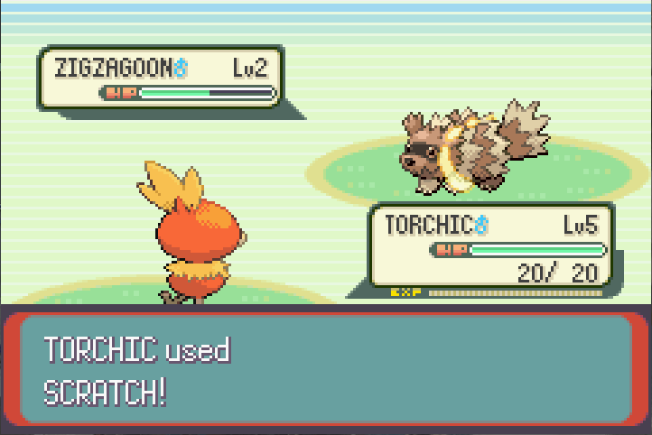

# :otter: **Jake used Scratch** :otter:

This started as a _Transformers from Scratch_ project, but turned into an _Everything from Scratch_ project. I am loosely following the [Transformer architecture diagram](md_resources/transformer_architecture.png) from Vaswani et al. 2017 (correcting for the current implementation which uses Pre-Layer Normalization rather than the visualized Post-Layer Normalization). 

With each component I have additionally explored other rabbit-holes and scratch built those here too. It is now my default repo for making scratch-implementations for learning purposes/when I'm bored.

If I've explicitly used other people's work as inspiration it'll be mentioned at the top of the file or with the appropriate function etc.

**Content so far:**

- [Toy Pokemon & YuGiOh Data Loader](transformer/toy_data/dataset_wrapper.py)
- [Forward Layer Implementation](transformer/neural.py) & [Test Neural Net](transformer/test_neural.py) with:
    - Layer Normalization
    - [He and Xavier Initialisation](transformer/utils/activation_functions.py)
    - Outputs for Simple, Binary Classification and Multiclass Classification problems
- [Simple Logistic Regression](transformer/regression.py) to [compare to NN for Pokemon Classification]:
    - Beginning with Linear Regression.
    - And a LocalFactorOutlier class for outlier removal. 
    - And a Logistic Regression class that inherets from the base linear regressor. 

**In Progress:**
- [BPE Tokenizer](transformer/utils/tokenizer.py)
- Positional Encodings
- Fixing LOF Implementation
- RNN because I stretched the forward layer to a full NN so may as well keep going (also curious to see how Vanilla FFNN + Positional Encodings works in comparison to Recurrence)

**Non-Exhaustive TODO:**
- The rest of the transformer diagram e.g. attention layers